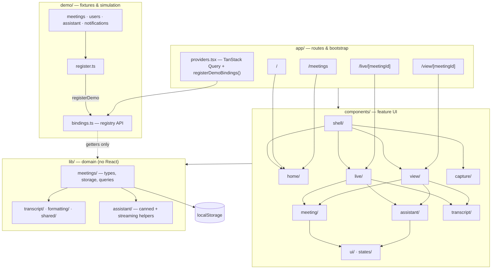

# Architecture

Client-only Next.js prototype: no backend, no auth, meetings persisted in the browser.

**Product flow:** capture (dialog) → live notes (`/live`) → stop & summarise → meeting detail (`/view`) → list (`/meetings`). Simulated transcript, delays, and Ask Fireflies replies come from `demo/` via the bindings registry so `lib/` can stay swappable for real APIs later.
