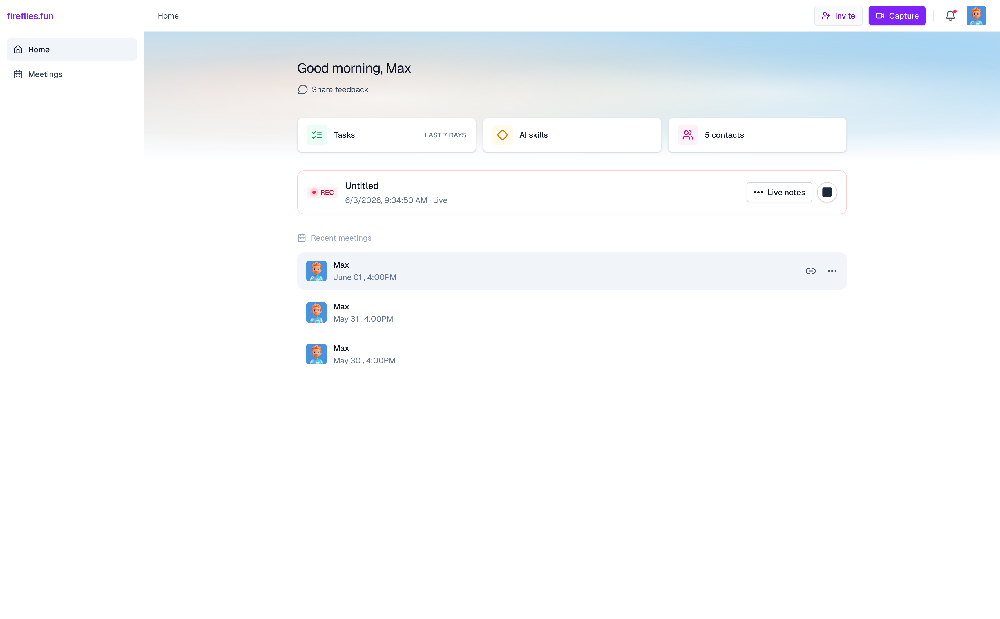

# Fireflies Challenge



A small app for browsing meetings, viewing transcripts, and chatting with the Fireflies assistant.

## Setup and run

**Prerequisites:** Node.js 20+ and npm.

1. Install dependencies:

   ```bash
   npm install
   ```

2. Start the development server:

   ```bash
   npm run dev
   ```

3. Open [http://localhost:3000](http://localhost:3000) in your browser.

<details>
<summary><strong>Other commands</strong></summary>

| Command           | Description              |
| ----------------- | ------------------------ |
| `npm run build`   | Production build         |
| `npm run start`   | Run the production build |
| `npm run lint`    | Run ESLint               |
| `npm test`        | Run tests (Vitest)       |

</details>

## Project description

### Approach
I approached this challenge with the mindset that it's a prototype to demonstrate the core Fireflies product loop of recording a meeting on an external platform.

I put effort into making the different workflows feel as interactive as possible by using delays and streaming simulations where required.

Additional Fireflies features like search, channels, and integrations were cut out so the prototype could focus on demonstrating the core capture > live notes > summary loop.

When evaluating the prototype I suggest you start with:
- Capture a new meeting, enter any text as the URL, and check out the live notes page
- Ask the assistant a couple of questions on the live notes page
- Stop the meeting, and then check out the meeting summary page
- Finish with the meetings overview page and use the stress-test button to add sample meetings

### Assumptions

- Single demo user, no authentication
- Simulated behaviour: Live transcript and post-stop delay are simulated 
- Capture URL isn't validated
- Stubs: Most menu actions are stubs
- `localStorage`: All meeting data is stored offline in the browser, with no auth or server connection
- Canned responses: Ask Fireflies assistant uses canned responses, no LLM connection
- Demo code: Fixtures/simulation code scoped to `demo/` directory, in case this prototype gets hooked up to data sources later on

